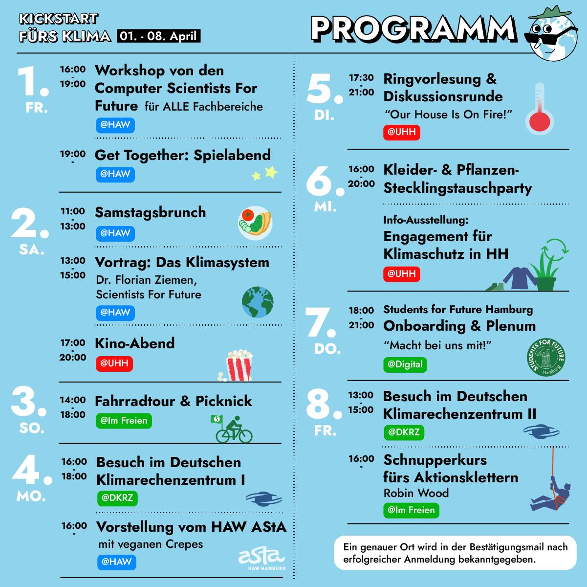

# Klima OE 22 

Im Folgenden findest du Informationen zu den einzelnen Programmpunkten. Zur Anmeldung kommst du hier: [https://fffutu.re/kickstartKlimaProgramm](https://fffutu.re/kickstartKlimaProgramm). Tretet außerdem für noch mehr Infos einer unserer unverbindlichen Teilnahmegruppen bei: [https://fffutu.re/kickstartKlimaInfos](https://fffutu.re/kickstartKlimaInfos)  

## Freitag, 01.04.2022

### [16:00] Workshop von den Computer Scientists For Future
ALLE Fachbereiche sind eingeladen.

Das Department Informatik stellt sich der Verantwortung und startet einen Veränderungsprozess, um die Ideen des Klimaschutzes und der Nachhaltigkeit (aus Sicht der Informatik) in das Curriculum, unseren Kontakten zu Industrie und Gesellschaft, in die Forschung und die Organisation zu integrieren. Wir möchten den Teilnehmern CS4F vorstellen und mit ihnen die aktive Rolle der Informatik in diesem Prozess diskutieren. Wo liegen Chancen, wo liegen Risiken. Insbesondere sind wir von CS4F an einem interdisziplinären Austausch interessiert. Wir freuen uns auf Freitag den 01.04.2022 um 16:00 Uhr im Gebäude BT7 (Campus Berliner Tor) im Raum 12.83.

### [19:00] Get Together 
Das Get Together soll ein entspannter Abend zum gegenseitigen Kennenlernen sein. Spiele und Getränke gibt es dort, ihr könnt aber auch gerne euer/eure Lieblingsspiel(e) mitbringen. Es wird ein offenes Ende geben, also mal sehen, wohin uns der Abend so verschlägt!    

## Samstag, 02.04.2022

### [11:00] Brunch & Vortrag von den Scientists For Future 
Hier erwartet euch ein gemeinsamen Brunch in gemütlicher Atmosphäre und direkt im Anschluss einen Vortrag von Dr. Florian Ziemen zum Klimasystem.   

### [17:00] Kino Abend 

Gemeinsamer Kinoabend in entspannter Atmosphäre.Veranstaltungsort ist die Uni HH, dort dürft ihr es euch mit Snacks und Getränken gemütlich machen. Es wird ein Film zum Thema Klimaschutz und Nachhaltigkeit gezeigt.   

## Sonntag, 03.04.2022

### [14:00] Fahrradtour 

Geplant ist eine Fahrradtour durch unsere  wunderschönen Hansestadt im Grünen. Dabei werden wir viele bekannte und auch unbekannte Orte entdecken - und euch zeigen das in Hamburg fast alles nur einen Katzensprung entfernt ist. Enden soll das ganze in einem schönen Picknick im grünen mit Essen, Snacks und Softdrinks und ganz vielleicht auch ein paar Bierchen gesponsort vom HAW-AstA. Es lohnt sich für Neu- und Althamburger gleichermaßen.

Startpunkt wird 14h der Spielplatz vor der HAW am Berliner Tor sein. Um 15h werden wir einen Zwischenstop an der UHH einlegen um weitere Fahrradbegeisterte aufzunehmen.
Falls ihr kein Fahrrad besitzt möchten wir euch auf diesem Wege auch die schönen Stafträder des HVV empfehlen - die Kosten für diese wären sogar für den Zeitraum der Tour über den AstA erstattungsfähig.

Wir freuen uns auf euch! 🚲

## Montag, 04.04.2022

### [16:00] Besuch im Deutschen Klimarechenzentrum I 
Hier unternehmen wir einen Besuch im Deutschen Klimarechenzentrum (DKRZ). Dort erhalten wir dann eine Führung, in der es um Klimasimulationen und die Hochleistungsrechnersysteme in der Klimaforschung gehen wird.        

### [16:00] Vorstellung vom HAW AStA mit Crepes 
Ein entspannter Abend zum AStA kennenlernen bei veganen Crêpes! 

## Dienstag, 05.04.2022

### [17:00, digital] Ringvorlesung + Diskussionsrunde 

Du interessiest dich fürs Klima, Nachhaltigkeit oder möchtest was ändern? Du kennst die Ringvorlesung "Our House is still on fire" schon aus dem letzten Semester oder hast davon gehört wie gut sie ist? Nein - dann möchtest du sie ganz bestimmt kennenlernen!

Wir werden gemeinsam in einem Hörsaal der UHH zum ersten mal eine "Live" gestreamte Ringvorlesung stattfinden lassen und uns die erste Vorlesung der Reihe gemeinsam anschauen - damit es sich auch endlich mal wieder wie "ich geh zur UNI anfühlt". Danach kann in offener oder kleiner Runde über Probleme und Lösungen gesprochen und diskutiert werden. Dazu gibts wie es sich für eine OE gehört Bier, Snacks und Softdrinks gesponsort vom HAW-AstA

## Mittwoch, 06.04.2022

### [16:00] Kleidertausch/ Pflanzenstecklingstauschparty & Engagement für Klima- und Naturschutz in Hamburg - Überblick 

Kleidungs- und Pflanzenstecklingstauschparty & Engagement für Klima- und Naturschutz in Hamburg - Überblick 
Bringt eure Kleidungsstücke oder Stecklinge und Pflanzen von zu Hause mit und tauscht sie gegen so viele neue ein, wie ihr mögt. Wir planen auch, einen Live-Workshop zum Ein- und Umtopfen stattfinden zu lassen. Für Erde sorgen wir, aber wenn ihr noch Töpfe übrig habt, sind die immer gern gesehen!

Gleichzeitig könnt ihr euch auch über Möglichkeiten zum Engagement für Klimaschutz in Hamburg informieren! In einer Info-Ausstellung präsentieren wir euch die verschiedenen Möglichkeiten, Projekte und NGO's, stehen für Fragen zur Verfügung und geben euch Anknüpfungspunkte, um direkt starten zu können.

Wie bei allen unseren diesjährigen Veranstaltungen sind wir sponsored by HAW-AstA und es gibt Softdrinks, Snacks und auch das ein oder andere Bier für euch.

## Donnerstag, 07.04.2022

### [18:00] Students For Future Onboarding 

Hier bekommst du eine kleine Einführungen in unsere Strukturen und kannst im Anschluss wenn du magst direkt an unserem Plenum teilnehmen.

## Freitag, 08.04.2022

### [16:00] Schnupperkurs fürs Aktionsklettern 
Zusammen mit den Aktivisti vom Wilden Wald gibt es einen Schnupperkletterkurs bei dem wichtige Sicherungstechniken gelernt werden. Außerdem werden unterschiedliche Möglichkeiten vorgestellt, wie das Klettern aktivistisch genutzt werden kann [z.B. Bannerdrop, Bäume klettern]
