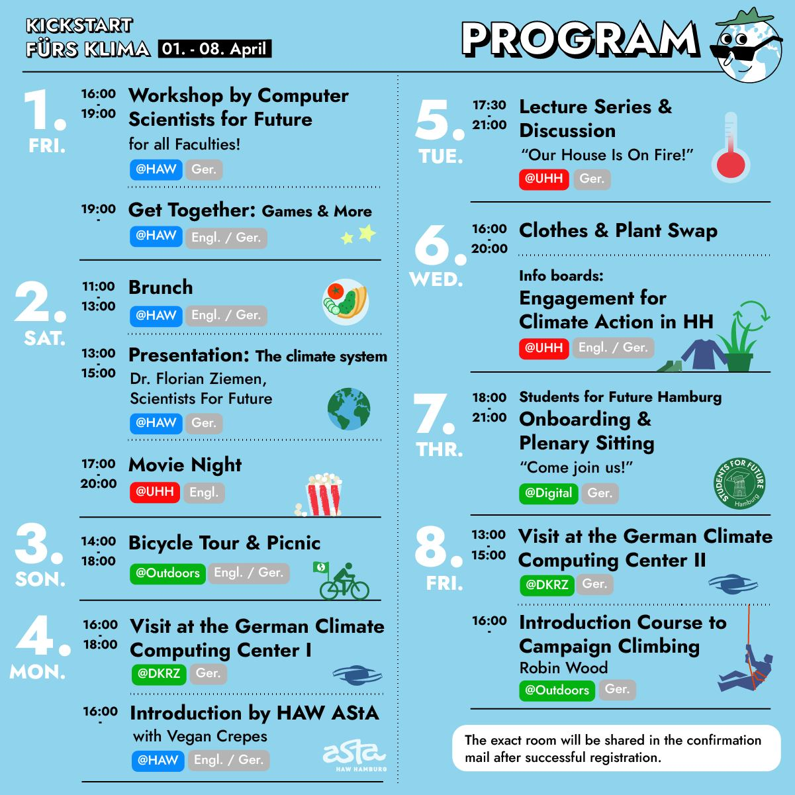

# Klima OE 22 

In the following, you'll find information on the program for the climate week, for signing up go to: [https://fffutu.re/kickstartKlimaProgramm](https://fffutu.re/kickstartKlimaProgramm). Also enter one of our infostreams on whatsapp or telegram: [https://fffutu.re/kickstartKlimaInfos](https://fffutu.re/kickstartKlimaInfos)  

## Freitag, 01.04.2022

### [16:00] Workshop of the Computer Scientists For Future
How can IT contribute to a more sustainable world? A workshop in which the objectives and challenges of the different departments are examined in order to derive opportunities for cooperation.

### [19:00] Get Together 
The Get Together will be an evening in a relaxed setting, in which we can just get to know each other. There will be games and some drinks, but you’re very welcome to bring your favorite game(s) as well. It’ll be an open-end event, so let’s see where the evening takes us
## Samstag, 02.04.2022

### [11:00] Brunch & Lecture by the Scientists For Future 
Enjoy a brunch together with us in a cozy atmosphere, followed by a lecture by Dr. Florian Ziemen on the climate system

### [17:00] Cinema Evening 

Cinema evening in a relaxed atmosphere.The venue is the Uni HH, where you can make yourself comfortable with snacks and drinks. A film on climate protection and sustainability will be shown.
## Sonntag, 03.04.2022

### [14:00] Bicycle Tour 

A bicycle tour through our beautiful Hanseatic city in the countryside is planned. We will discover many known and unknown places – and show you that almost everything in Hamburg is just a stone’s throw away. We will end the tour with a nice picnic in the countryside with food, snacks and soft drinks and maybe even a few drinks sponsored by the HAW-AStA. It is worthwhile for new and old Hamburgers alike.

## Montag, 04.04.2022

### [16:00] Visit of the Deutsches Klimarechenzentrum I 
We will visit the German Climate Computing Center (DKRZ), where we will receive a guided tour that focus’ on climate simulations and high-performance computer systems in climate research.

### [16:00] Get-Together HAW AStA with Crepes 

A relaxed evening to get to know AStA with vegan crêpes!

## Dienstag, 05.04.2022

### [17:00, digital] Ring Lecture + Discussion 

For the first time, we will watch the first lecture of the series in a “live” stream together (in the UHH) – so that it will finally feel like “I’m going to UNI.” Afterwards, problems and solutions can be discussed in open or small groups. The HAW-AStA will also provide drinks and snacks.

## Mittwoch, 06.04.2022

### [16:00] clothes or plants and exchange & Engagement for climate- und nature protection in Hamburg - Überblick 

Bring your clothes or plants and exchange them for as many new ones as you like! There will also be a live workshop for potting and repotting plants. At the same time, you will also be able to find out more ways to get involved in climate protection in Hamburg in an information exhibition. We will provide some soft drinks, snacks and also some drinks.

## Donnerstag, 07.04.2022

### [18:00] Students For Future Onboarding 

You will get a small introduction to our structures and you can then take part in our plenary session if you like.

## Freitag, 08.04.2022

### [13:00] Visit of the Deutsches Klimarechenzentrum II
We will visit the German Climate Computing Center (DKRZ), where we will receive a guided tour that focus’ on climate simulations and high-performance computer systems in climate research.

### [16:00] Climbin course  
Together with the activists of the Wilder Wald, there is a taster climbing course where important safety techniques are learned. In addition, different possibilities are presented, how climbing can be used activistly (e.g. banner drop, climbing trees) 
